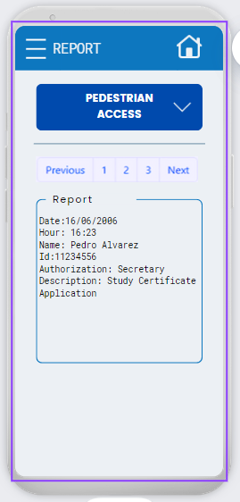

# Diseno De Minapp
Los mockups fueron realizados primeramente en Canva y seguido el prototipo en Marvel los recursos a esto lo encontraran al final del documento. En este documento solo se mostraran las pantallas mas importantes el resto las pueden ver en la seccion de recursos. 

## 1. Login

Depende el del rango de la persona dentro del trabajo lo que se le mostraria seria distinto si es un guarda de seguridad este tendra acceso a los registros, en caso de ser un supervisor o la central estos tendran acceso a los reportes.
Tras el Login se encontrara con la siguiente Imagen:

## 2. Acciones del Guarda de Seguridad

  ###   - Observations
  
  ###   - Pedestrian Access
  
  
  ###   - Vehicular
  
  
  ###   - Element
  
  
  ###   - Report
  

## 3. Acciones de Supervisores o Central
  ###   - Search Headquarters
  
  ###   - Search Employee
  

## Recursos:

[Design_Canvas](https://www.canva.com/design/DAGDz1qTpTM/9IeqHv_WUc76YYqTC1fo3A/view?mode=prototype)
[Marvel-Prototipo](https://marvelapp.com/prototype/10caei9h)
